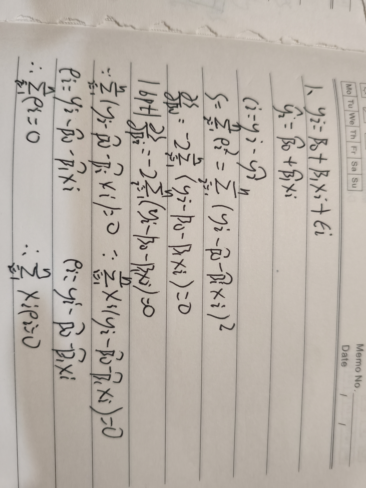

# 作业：一元线性回归残差性质证明

## 题目截图

## 1 模型定义
一元线性回归模型：
$$y_i=\beta_0+\beta_1 x_i+\varepsilon_i$$
拟合方程：
$$\hat y_i=\hat\beta_0+\hat\beta_1 x_i$$
残差定义：
$$e_i = y_i-\hat y_i$$

最小二乘目标：最小化残差平方和
$$S=\sum_{i=1}^n e_i^2=\sum_{i=1}^n (y_i-\hat\beta_0-\hat\beta_1 x_i)^2$$

对参数求偏导并置0，得到正规方程组：
$$
\begin{cases}
\displaystyle\frac{\partial S}{\partial \hat\beta_0}
=-2\sum_{i=1}^n(y_i-\hat\beta_0-\hat\beta_1 x_i)=0 \\[6pt]
\displaystyle\frac{\partial S}{\partial \hat\beta_1}
=-2\sum_{i=1}^n x_i(y_i-\hat\beta_0-\hat\beta_1 x_i)=0
\end{cases}
$$

### (1) 证明 $\sum_{i=1}^n e_i=0$
由第一个一阶条件：
$$
\sum_{i=1}^n(y_i-\hat\beta_0-\hat\beta_1 x_i)=0
$$
残差 $e_i=y_i-\hat\beta_0-\hat\beta_1 x_i$，代入得：
$$
\boldsymbol{\sum_{i=1}^n e_i=0}
$$

### (2) 证明 $\sum_{i=1}^n x_i e_i=0$
第二个一阶条件：
$$
\sum_{i=1}^n x_i(y_i-\hat\beta_0-\hat\beta_1 x_i)=0
$$
代入残差定义：
$$
\boldsymbol{\sum_{i=1}^n x_i e_i=0}
$$

> 说明：该性质来自带截距项最小二乘的一阶最优条件，无截距回归不满足残差和为0。

